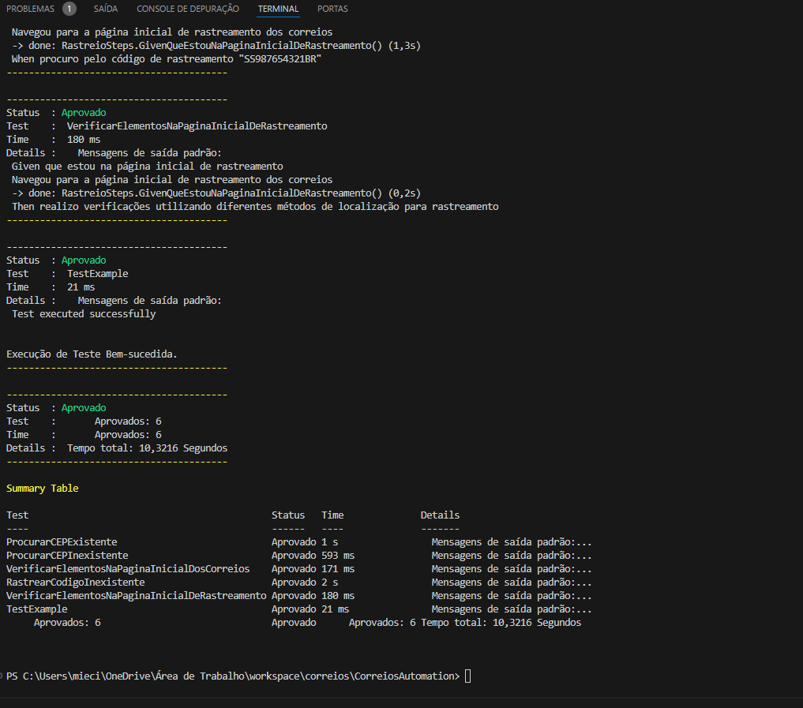

---

# Teste de Automação - Avaliação Busca CEP

## Descrição

Este projeto é um desafio para uma vaga de QA, focado na automação de testes utilizando C# com SpecFlow e NUnit. O objetivo é criar um script que automatize a busca de CEPs e o rastreamento de códigos, verificando a existência dos CEPs e a validade de um código de rastreamento.

Devido ao uso de reCAPTCHA no novo site dos Correios, foi necessário mudar a abordagem para outros links que garantem a cobertura dos testes conforme solicitado.

## Passo a Passo

1. **Entre no site de busca de CEP alternativo:**
   - Acesse a página inicial de busca de CEP.

2. **Procure pelo CEP 80700000:**
   - Confirme que o CEP não existe.

3. **Volte à tela inicial.**

4. **Procure pelo CEP 01013-001:**
   - Confirme que o resultado seja "Rua Quinze de Novembro, São Paulo/SP".

5. **Volte à tela inicial.**

6. **Procurar no rastreamento de código alternativo o número “SS987654321BR”:**
   - Confirme que o código não está correto.

7. **Feche o browser.**

## Pré-requisitos

- .NET SDK 6.0 ou superior
- ChromeDriver compatível com a versão do seu Google Chrome
- Visual Studio 2019 ou superior (com suporte ao desenvolvimento em .NET e extensões para NUnit e SpecFlow)
- Git

## Como Executar

### Opção 1: Usando o script RunTests.ps1

1. **Clone o repositório:**

   ```sh
   git clone https://github.com/mieciocosta/correios.git
   cd correios/CorreiosAutomation
   ```

2. **Restaure os pacotes NuGet:**

   ```sh
   dotnet restore
   ```

3. **Compile o projeto:**

   ```sh
   dotnet build
   ```

4. **Execute o script de testes:**

   ```sh
   ./RunTests.ps1
   ```

   O script `RunTests.ps1` faz a execução dos testes, captura os resultados e exibe-os de forma organizada e colorida no terminal.

### Opção 2: Executando diretamente pelo dotnet CLI

1. **Clone o repositório:**

   ```sh
   git clone https://github.com/mieciocosta/correios.git
   cd correios/CorreiosAutomation
   ```

2. **Restaure os pacotes NuGet:**

   ```sh
   dotnet restore
   ```

3. **Compile o projeto:**

   ```sh
   dotnet build
   ```

4. **Execute os testes:**

   ```sh
   dotnet test --logger "console;verbosity=detailed"
   ```

   Esta abordagem é útil caso você não queira utilizar o script PowerShell e prefira visualizar os resultados diretamente pela CLI do dotnet.

## Estrutura do Projeto

```
correios
├── bin
├── Config
│   └── config.json
├── Features
│   ├── BuscaCep.feature
│   └── Rastreio.feature
├── obj
├── Pages
│   ├── BuscaCepPage.cs
│   └── RastreioPage.cs
├── StepDefinitions
│   ├── BuscaCepSteps.cs
│   └── RastreioSteps.cs
├── Tests
│   └── RunTests.ps1
├── CorreiosAutomation.csproj
├── CorreiosAutomation.sln
├── nunit.runner.json
└── test.log
```

## Comandos GIT para Versionamento

1. **Inicialize um repositório Git:**

   ```sh
   git init
   ```

2. **Adicione o repositório remoto:**

   ```sh
   git remote add origin https://github.com/mieciocosta/correios.git
   ```

3. **Adicione todos os arquivos ao staging:**

   ```sh
   git add .
   ```

4. **Faça um commit das mudanças:**

   ```sh
   git commit -m "Initial commit"
   ```

5. **Suba os arquivos para o repositório GitHub:**

   ```sh
   git push -u origin master
   ```

## Otimizações

- Utilização de variáveis de configuração para URLs e seletores.
- Separação das features e steps por contexto.
- Implementação de paralelismo para execução mais rápida dos testes.

## Resultados

Veja abaixo um exemplo dos resultados dos testes:

[Resultados da Execução]

```
-------------------------------------------------------
| Status   | Test                                  | Time   | Details                               |
-------------------------------------------------------
| Aprovado | ProcurarCEPExistente                  | 1s     | Mensagens de saída padrão...          |
| Aprovado | ProcurarCEPInexistente                | 553ms  | Mensagens de saída padrão...          |
| Aprovado | VerificarElementosNaPaginaInicial     | 160ms  | Mensagens de saída padrão...          |
| Aprovado | RastrearCodigoInexistente             | 3s     | Mensagens de saída padrão...          |
| Aprovado | VerificarElementosNaPaginaInicialRast | 177ms  | Mensagens de saída padrão...          |
| Aprovado | TestExample                           | 15ms   | Mensagens de saída padrão...          |
-------------------------------------------------------
| Aprovados: 6 Tempo total: 10,3216 Segundos
-------------------------------------------------------
```

---